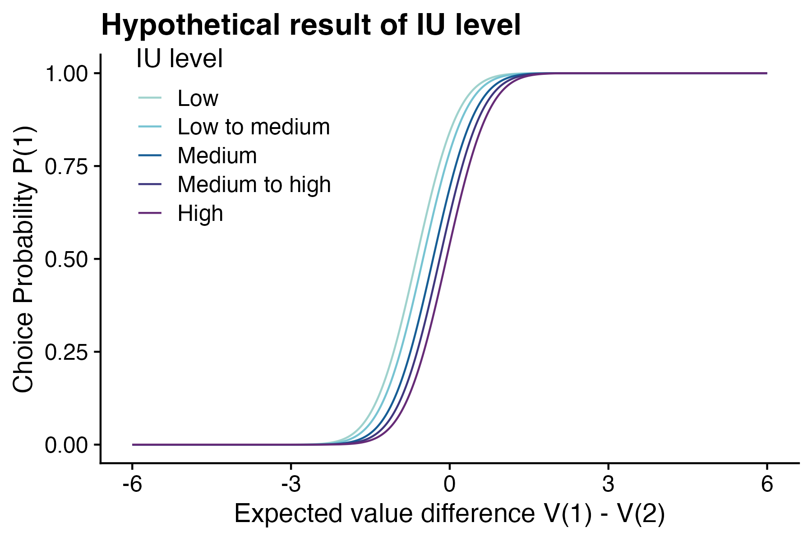
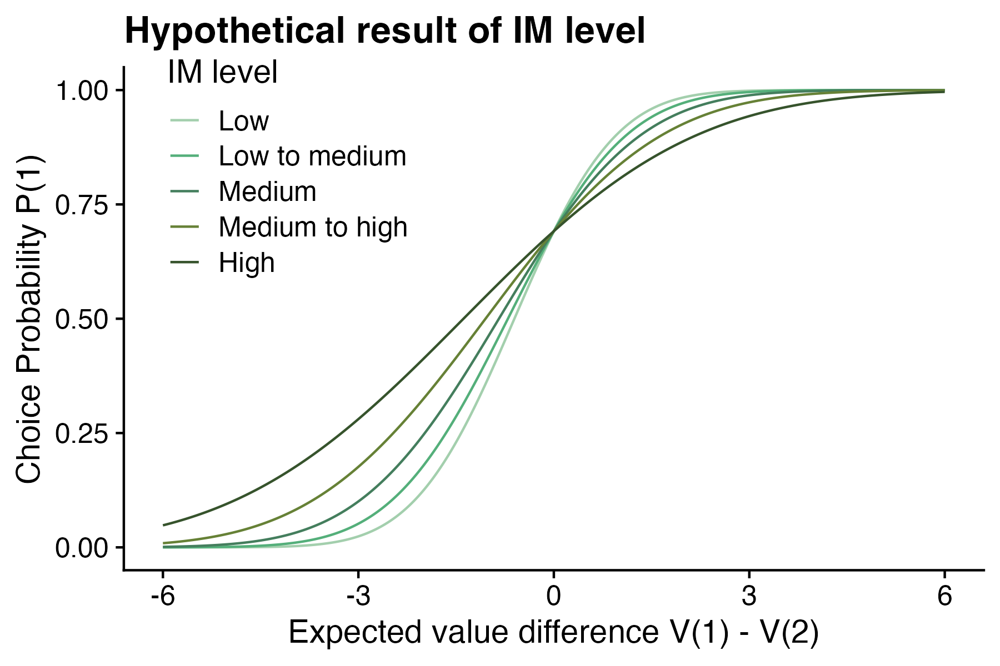
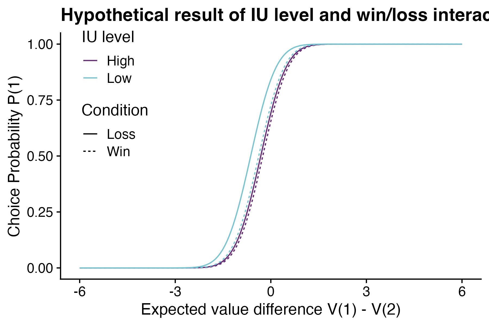
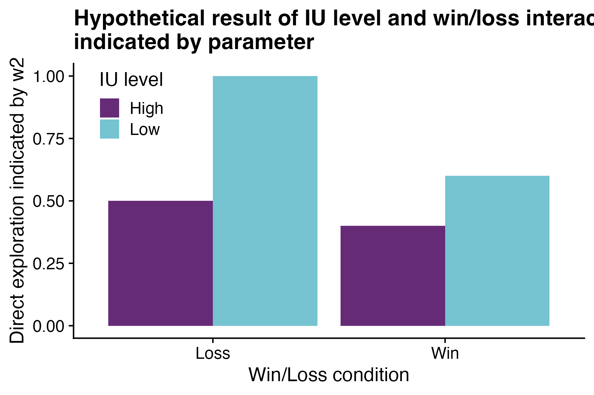
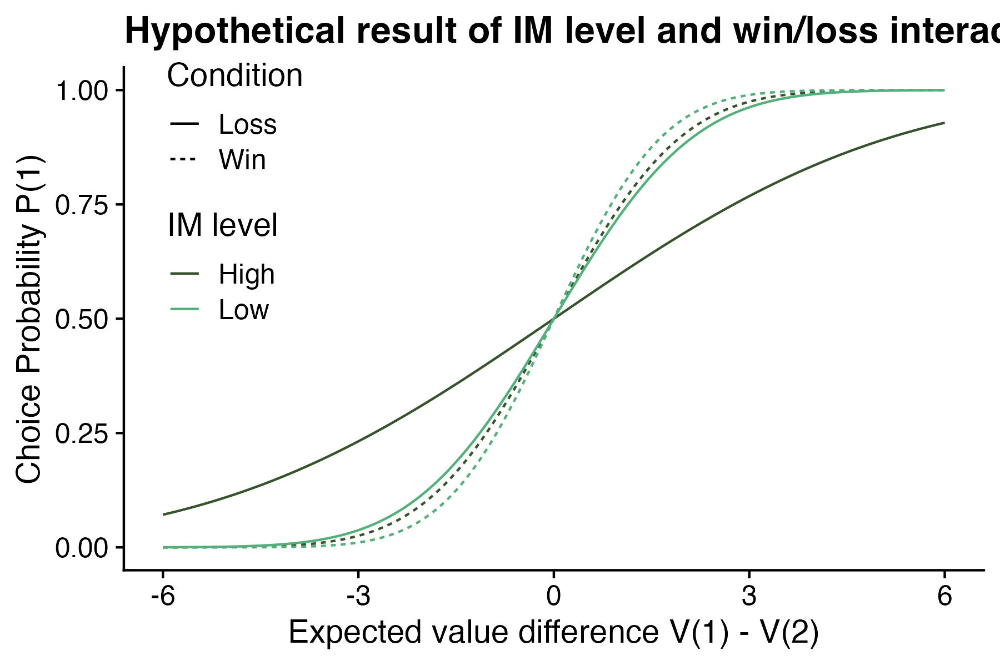

H1: High intolerance of uncertainty (IU) lead to less direct exploration

H2: High impulsivity (IM) will lead to more random exploration

H3: In loss condition, participates with lower IU will show a similar level of direct exploration compared to participates with higher IU. In win condition, participates with lower IU will show a greater increase in direct exploration compared to participates with higher IU.

H4: In win condition, participates with higher IM will show a small higher random exploration compared to participates with lower IM In loss condition, participates with higher IM will show a greater increase in random exploration compared to participates with lower IM.

