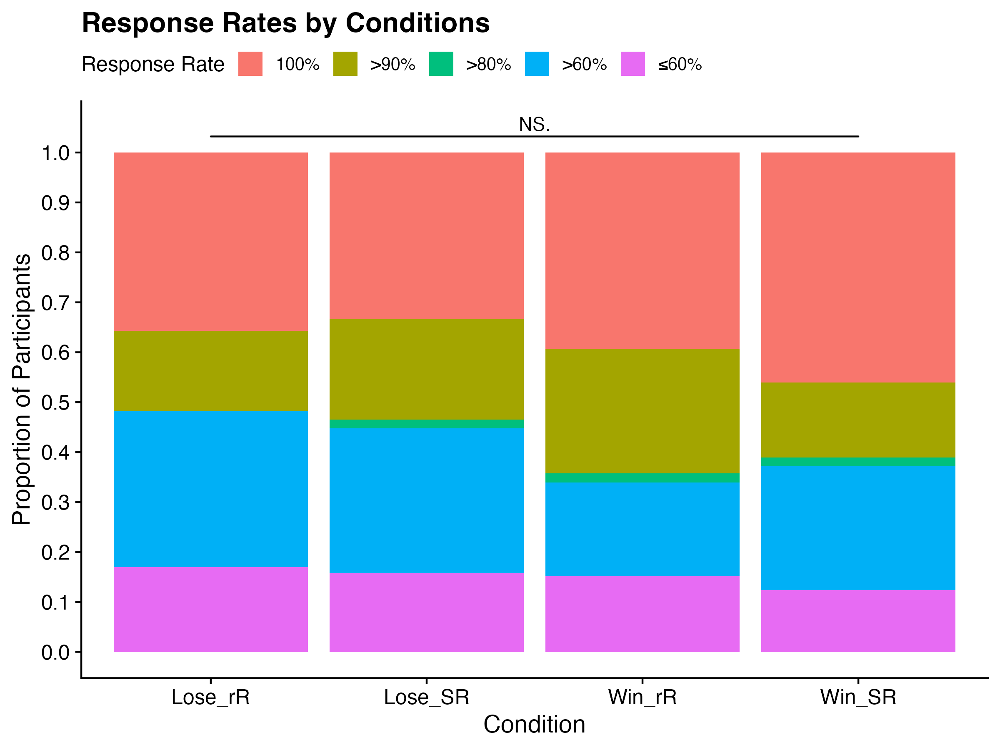
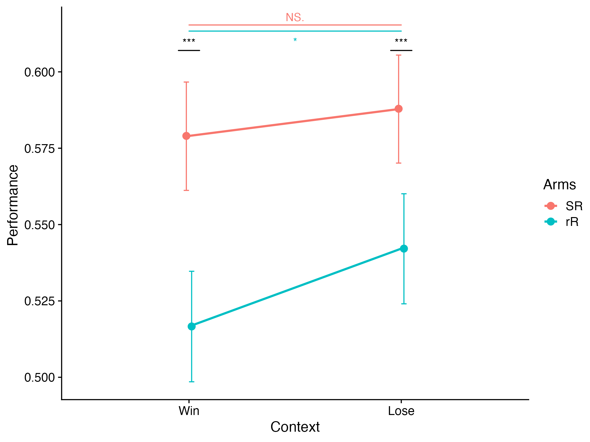
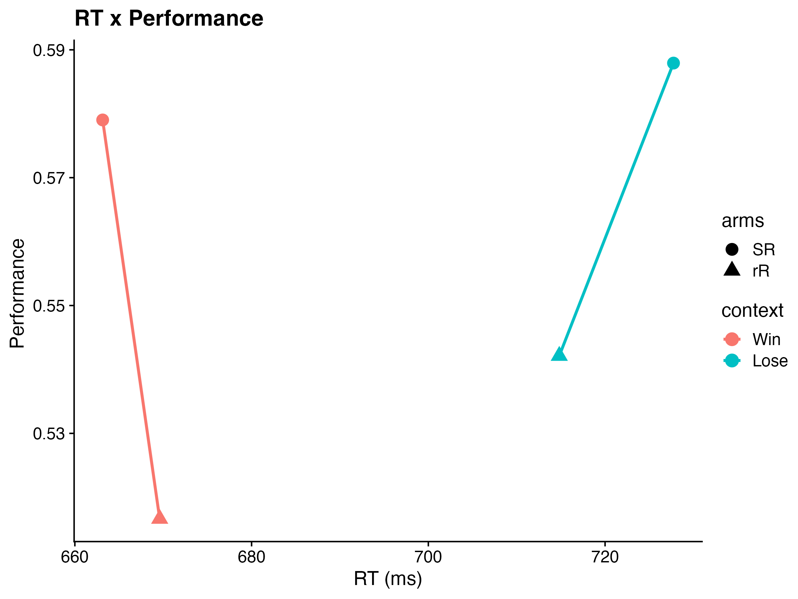
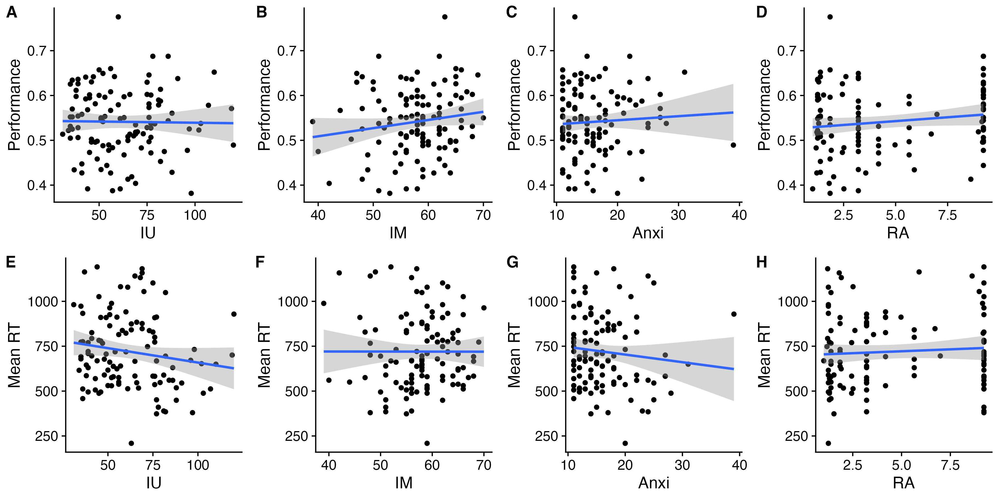
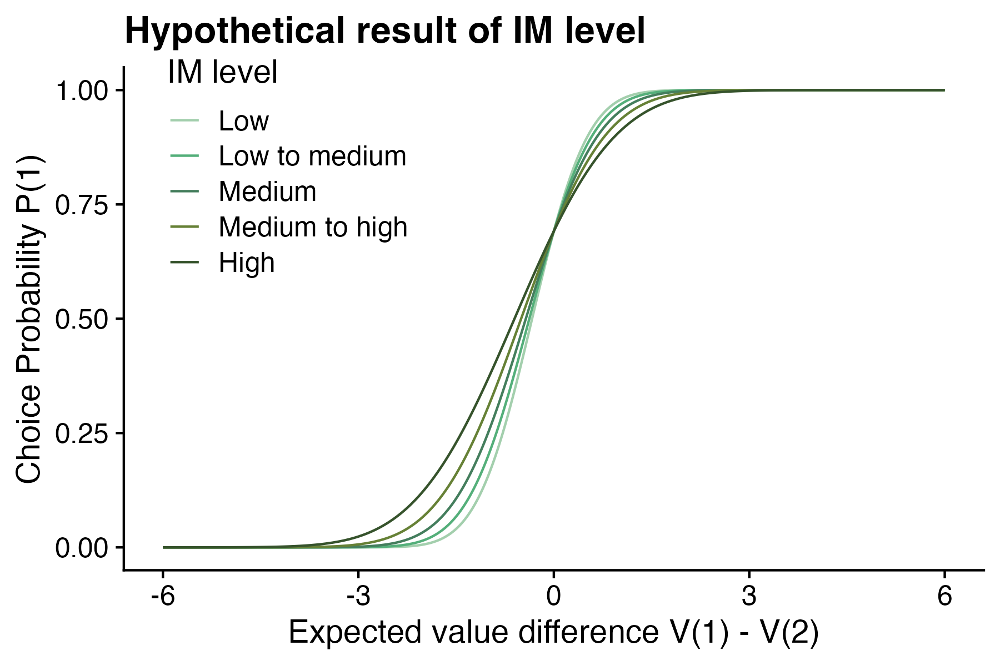
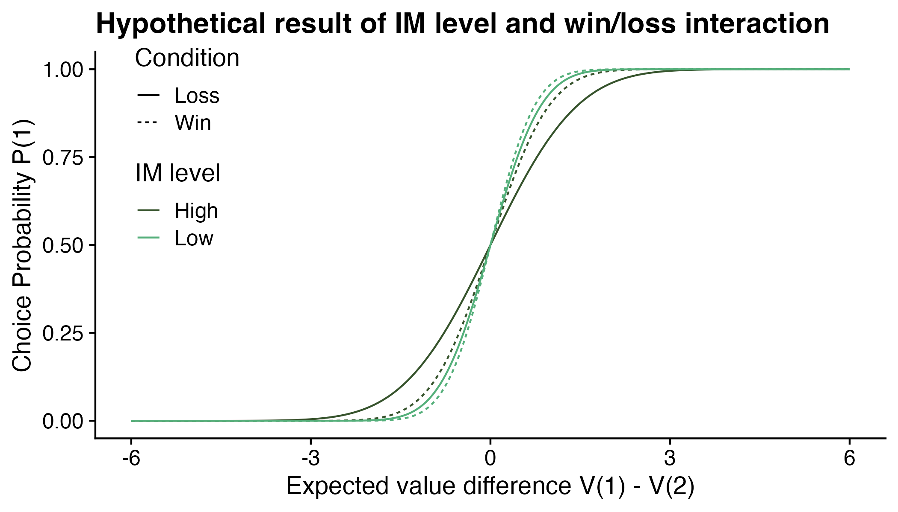

Descriptive statistics results

# Demographic

# Response rate

Checked whether there is any condition perticularly hard for the participants to make a decision.

# RT

# Accuracy

The accuracy is calculated by the number of correct choices (high expected value) divided by the total number of choices.

This distribution is calculated by averaging the accuracy of each participant.

In sum, the RT and accuracy are respectively affected by frame and arms.

# Trait

-   Higher levels of IU significantly predict lower accuracy and quick decision of the participants.
-   Higher levels of IM significantly predict higher accuracy.
-   Higher levels of Anx significantly predict higher accuracy.
-   Higher levels of RA significantly predict slower decision of the participants.

------------------------------------------------------------------------

The psychometric curves is generated by the following equation:

$$
P(a=1|w)=\Phi(w_1 \times V+ w_2 \times RU + w_3 \times V/TU)
$$

where $w_1$ is fixed to 1, and the value of $w_2$, $w_3$ are assigned arbitrarily for the sake of demonstration. RU is fixed to 1 for convenience in SR condition, while in rR condition RU is fixed to 0.55. TU is assigned to 1.72 and 1.89 respectively. (Please read the pdf or code for detail and reason)

H1: High intolerance of uncertainty (IU) lead to less direct exploration

H2: High impulsivity (IM) will lead to more random exploration

H3: In loss condition, participates with lower IU will show a similar level of direct exploration compared to participates with higher IU. In win condition, participates with lower IU will show a greater increase in direct exploration compared to participates with higher IU.

H4: In win condition, participates with higher IM will show a small higher random exploration compared to participates with lower IM In loss condition, participates with higher IM will show a greater increase in random exploration compared to participates with lower IM.

