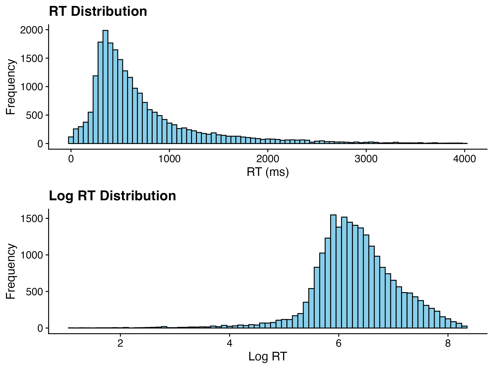
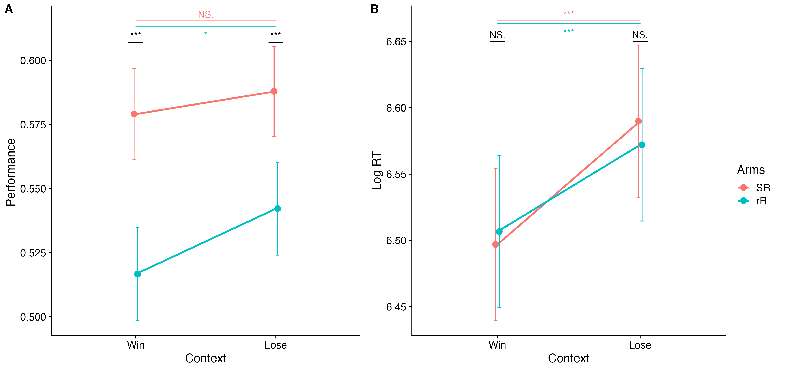
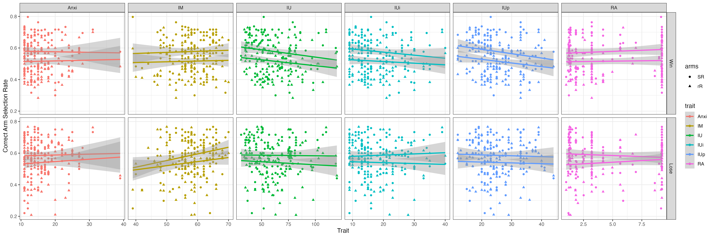
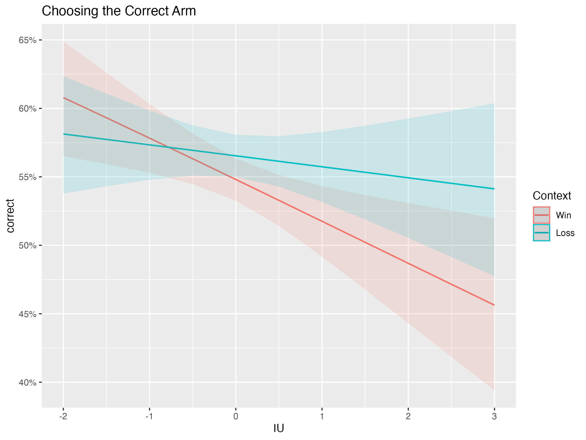
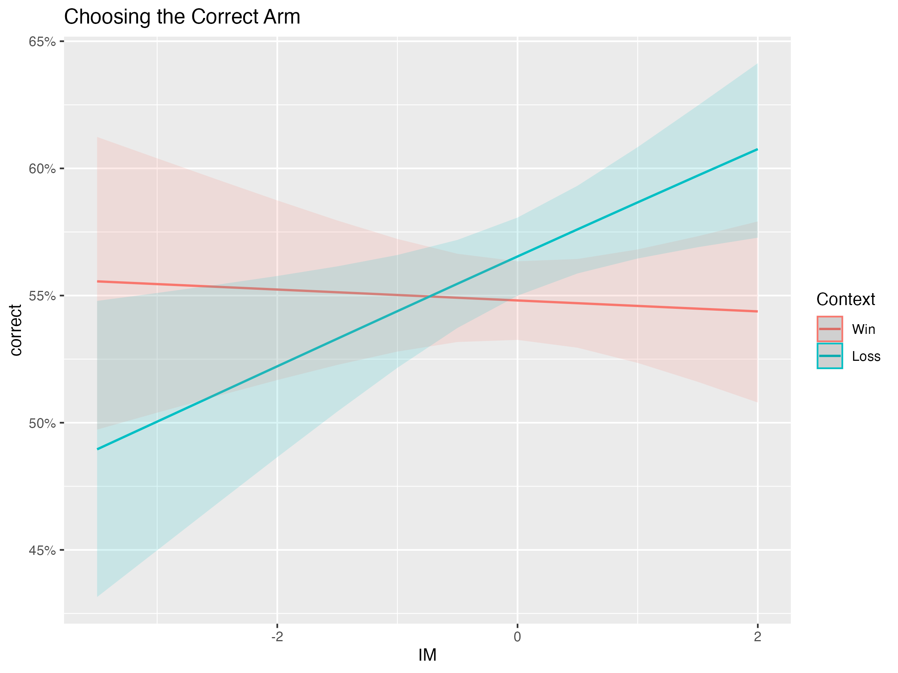
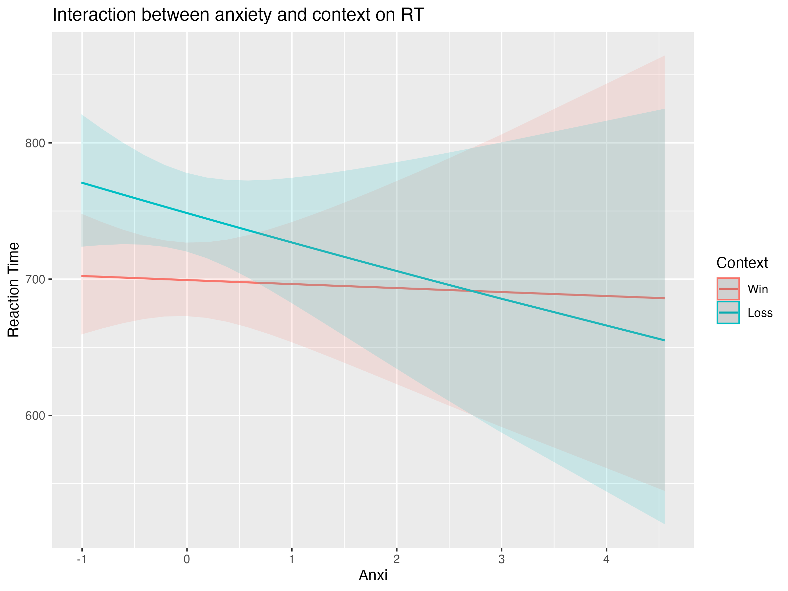
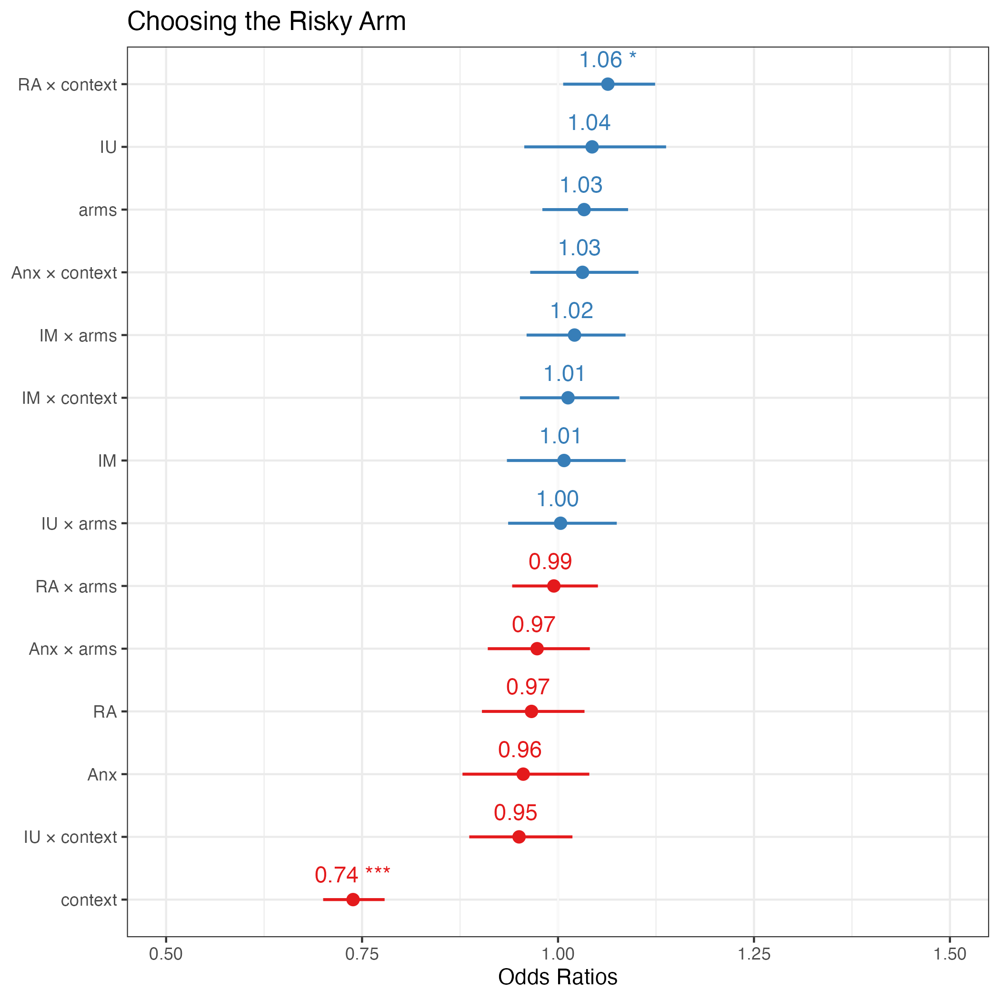
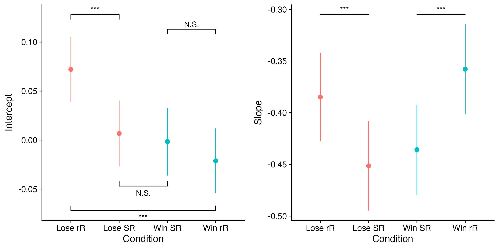
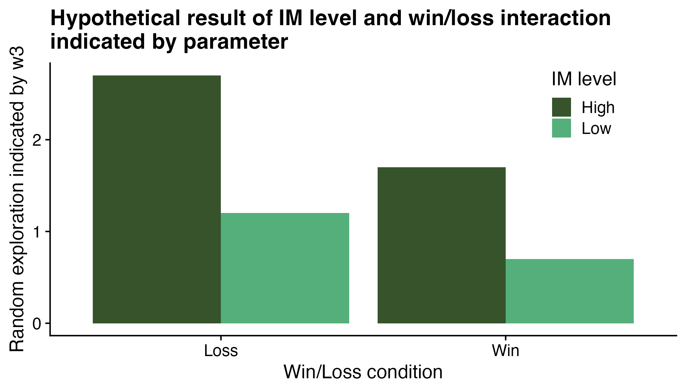

# Main Results

# Demographic

# Response rate

Checked whether there is any condition perticularly hard for the participants to make a decision.

# RT

# Accuracy

The accuracy is calculated by the number of correct choices (high expected value) divided by the total number of choices.

This distribution is calculated by averaging the accuracy of each participant.

In sum, the RT and accuracy are respectively affected by frame and arms.

# Traits

The significant level of upper triangle are Bonferroni corrected.

None of traits can predict the accuracy and RT in individual level.

## Accuracy by context

Regression: Correct arm \~ (IU + IM + Anx + RA) \* (context + arms) + (1\|subjectID)

### Effect of IU

### IU x context

### IM x context

## RT by context

Regression: RT \~ (IU + IM + Anx + RA) \* (context + arms) + (1\|subjectID)

### Ani x context

## Risky arm selection rate

Individual level risky arm selection rate by context and traits

Regression: Risky arm \~ (IU + IM + Anx + RA) \* (context + arms) + (1\|subjectID)

# Manipulation check

## Main effect of conditions

-   Adding total uncertainty (rR vs. SR) led to more random exploration (gentle slope)
-   Gain-framed condition (win vs, loss) led to more directed exploration (positive intercept)

## Learning in different conditions

The density of the learned value difference (Kalman filter) have 5 peaks, which indicates that the participants have learned the value of the arms.

# Modelling

## Fixed effect

## Random effect

Four models have similar random effect distribution

# Robust check

Setting the prior of Q as 0, the most of the coefficients are consistent with the original result (no significant difference). However, the coefficient of the V, RU, VTU and their interaction with context are significantly different. This might be due to the fact that we removed the random slope V as 3 random slope will lead to singularity. The random slope V can be removed as VTU contains the information of V.

------------------------------------------------------------------------

The psychometric curves is generated by the following equation:

$$
P(a=1|w)=\Phi(w_1 \times V+ w_2 \times RU + w_3 \times V/TU)
$$

where $w_1$ is fixed to 1, and the value of $w_2$, $w_3$ are assigned arbitrarily for the sake of demonstration. RU is fixed to 1 for convenience in SR condition, while in rR condition RU is fixed to 0.55. TU is assigned to 1.72 and 1.89 respectively. (Please read the pdf or code for detail and reason)

H1: High intolerance of uncertainty (IU) lead to less direct exploration

H2: High impulsivity (IM) will lead to more random exploration

H3: In loss condition, participates with lower IU will show a similar level of direct exploration compared to participates with higher IU. In win condition, participates with lower IU will show a greater increase in direct exploration compared to participates with higher IU.

H4: In win condition, participates with higher IM will show a small higher random exploration compared to participates with lower IM In loss condition, participates with higher IM will show a greater increase in random exploration compared to participates with lower IM.

